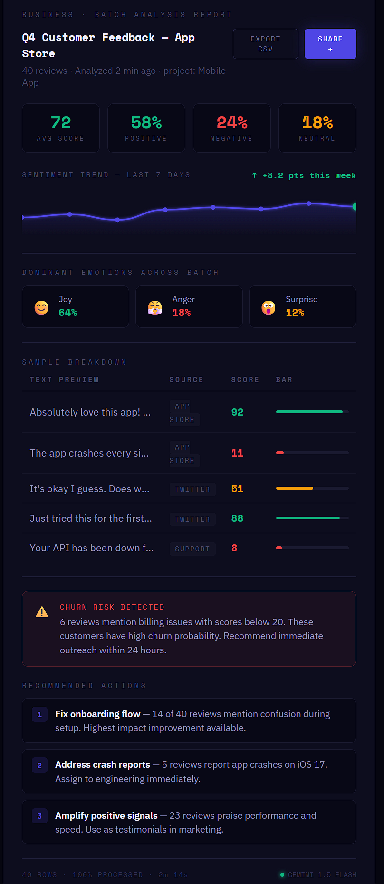
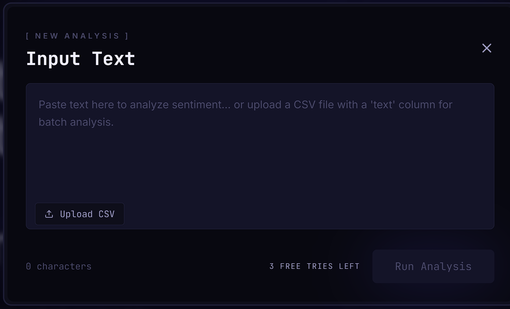

# PULSE — Sentiment Intelligence Platform

> A full-stack sentiment intelligence platform for analyzing text at scale.

PULSE processes individual text inputs, large CSV datasets, or API requests and returns structured sentiment scores, emotion distributions, keyword extraction, and AI-generated summaries.

---

## Screenshots

| Landing Page | Dashboard Overview | Batch Analysis |
|---|---|---|
|  |  |  |

---

## Features

- **Real-time analysis** — sentiment score, confidence, multi-emotion vector (joy, anger, surprise, etc.), keyword extraction, and AI-generated summary
- **Batch processing** — upload CSV datasets, enrich rows with sentiment data, and export results
- **Analytics dashboard** — visualize sentiment distributions, trends, and analysis history
- **Developer API** — secure REST endpoints with API key management
- **Auth & security** — JWT authentication, rate limiting, request validation, and hardened middleware

---

## Tech Stack

| Layer | Technology |
|---|---|
| Frontend | Next.js 14, Tailwind CSS |
| Data Fetching | TanStack Query |
| Backend | Node.js, Express, TypeScript |
| AI Processing | Google Gemini 1.5 Flash, Groq |
| Database | PostgreSQL (Neon) |
| ORM | Drizzle ORM |
| Caching | Redis (Upstash) |
| Authentication | Clerk |
| Validation | Zod |
| Security | Helmet, CORS, rate limiting |
| 3D Visualization | Three.js |

---

## Project Structure

```
pulse-sentiment/
├── apps/
│   ├── web/        # Next.js application (frontend + dashboard)
│   └── api/        # Express API service
├── packages/
│   └── shared/     # Shared TypeScript types
└── package.json    # Monorepo configuration
```

---

## Getting Started

### Prerequisites

- Node.js 20+
- pnpm
- PostgreSQL database
- Redis instance
- Clerk authentication project
- Google AI Studio API key

### Installation

```bash
git clone https://github.com/arsonic-dev/pulse-sentiment.git
cd pulse-sentiment
pnpm install
```

### Configure Environment

Populate the following environment files with your credentials:

```
apps/api/.env
apps/web/.env.local
```

### Run Development Servers

```bash
pnpm dev
```

| Service | URL |
|---|---|
| Frontend | http://localhost:3000 |
| API | http://localhost:8081 |
| Health check | http://localhost:8081/health |

---

## API Reference

Base URL: `/api/v1`

Authenticated endpoints require a valid `Bearer` JWT token.

| Method | Endpoint | Description |
|---|---|---|
| `POST` | `/analyze` | Analyze a single text input |
| `GET` | `/analyses` | Retrieve analysis history |
| `GET` | `/analyses/:id` | Fetch analysis details |
| `DELETE` | `/analyses/:id` | Delete analysis |
| `GET` | `/projects` | List projects |
| `POST` | `/projects` | Create project |
| `PATCH` | `/projects/:id` | Update project |
| `DELETE` | `/projects/:id` | Delete project |
| `GET` | `/keys` | List API keys |
| `POST` | `/keys` | Generate API key |
| `DELETE` | `/keys/:id` | Revoke API key |
| `GET` | `/dashboard/stats` | Retrieve dashboard statistics |

### Example

**Request**

```bash
curl -X POST https://your-api-url.com/api/v1/analyze \
  -H "Content-Type: application/json" \
  -d '{"text":"This product completely changed how I work. Absolutely love it."}'
```

**Response**

```json
{
  "data": {
    "score": 94,
    "label": "very positive",
    "confidence": 0.97,
    "emotions": {
      "joy": 0.88,
      "surprise": 0.31,
      "anger": 0.02
    },
    "keywords": ["product", "changed", "love"],
    "summary": "Strongly positive review expressing satisfaction."
  }
}
```

---

## Roadmap

- Distributed CSV batch processing using queue workers
- Subscription and usage-based billing
- Production deployment infrastructure
- Extended analytics and reporting

---

## License

MIT License © 2026 Ankit Kumar

---

## Author

**Ankit Kumar** — AI / ML Engineer · NLP · Computer Vision · Full-Stack AI Systems

[GitHub](https://github.com/arsonic-dev)